## install
```bash

pnpm i image-rs

```

## usage
```ts
import {decode} from 'image-rs'
const buf = fs.readFileSync('./assets/win.jpg')
const { width, height, channel, pixels } = decode(buf)
expect(width * height * channel).toEqual(pixels.length)
```

## bench
```bash
pnpm run bench --run | ansi2 > assets/bench.svg
```

<div align="center">
  <a href="https://github.com/ahaoboy/image-rs">
    
  </a>
</div>